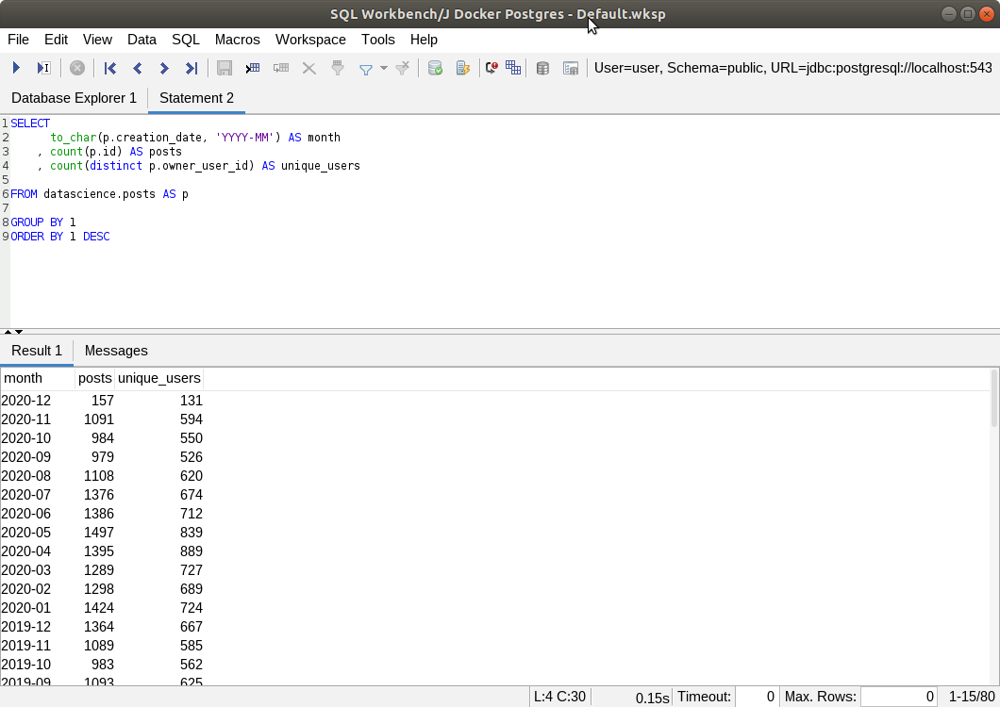

 

## Introduction

In this article, I'll show you how you can easily spin up a data warehouse (Postgres) on your computer with real-world data from [Data Science StackExchange](https://datascience.stackexchange.com/).

##### **But why?**

Whether you're an aspiring data scientist, an expert business intelligence developer, or anything else in between, you can use this to hone your **SQL skills** by practicing it on actual data collected by an actual company. 

Plus you can even connect this data warehouse instance to BI software like **Tableau** or **Power BI** so you can both practice data visualization and build an online portfolio when you publish your work on [Tableau Public](https://public.tableau.com/en-us/gallery) or [Power BI Community](https://community.powerbi.com/t5/Galleries/ct-p/PBI_Comm_Galleries)

 

## Just four steps:

Hopefully you're using MacOS or Ubuntu. If you're on Windows, be more patient and Godspeed!

1. **Install Docker.**
    - **[For Windows](https://docs.docker.com/docker-for-windows/install/)**, follow the instructions carefully, especially the *System Requirements* section.
    - **[For MacOS](https://docs.docker.com/docker-for-mac/install/)**.
    - **[For Ubuntu](https://docs.docker.com/engine/install/ubuntu/)**.
      
    
1. **Run this command via Terminal (for Mac/Ubuntu) or via PowerShell (for Windows):**
    - `docker run -p 5439:5432 -d rmasi/misc:stack-exchange-dwh`
    - 
    - If you get permission errors, try `sudo docker run -p 5439:5432 -d rmasi/misc:stack-exchange-dwh` instead.
      
    
1. **Connect your SQL client, e.g. [SQLWorkbench/J](https://www.sql-workbench.eu/). **
    - Use the following parameters:
        - username: `user`
        - password: `password`
        - hostname: `localhost`
        - port: `5439`
        - JDBC URL: `jdbc:postgresql://localhost:5439/database`
        - driver: [PostgreSQL](https://jdbc.postgresql.org/download.html)
    - 
      
    
1. **Fire away!**
    - Explore the tables in the `datascience` schema using the Database Explorer.
    - 

 

## What's in this dataset?

The dataset is from Data Science StackExchange, similar to StackOverflow but focusing on data science topics. The tables contain structured data from the website's user-generated content such as posts, tags, comments, users, votes, etc.

Unlike other free datasets online, this is a complete copy of a relational database, perfect for practicing SQL select statements, joins, aggregate functions, etc.. Most companies store their data this way and it's a good way to simulate actual work in an actual company.

 

## Some final words...

As of the time of writing, I have yet to analyze the data myself. But of course, having the infrastructure is always the first step in analyzing data *(at least via SQL)*. Again, just like in the real world. Good luck and happy querying!

Check out the github project here [[r-mas/stack-exchange-dwh](https://www.github.com/r-mas/stack-exchange-dwh)].

  
**Banner photo by <a href="https://unsplash.com/@chuttersnap?utm_source=unsplash&amp;utm_medium=referral&amp;utm_content=creditCopyText">CHUTTERSNAP</a> on <a href="https://unsplash.com/s/photos/data-warehouse?utm_source=unsplash&amp;utm_medium=referral&amp;utm_content=creditCopyText">Unsplash</a>

